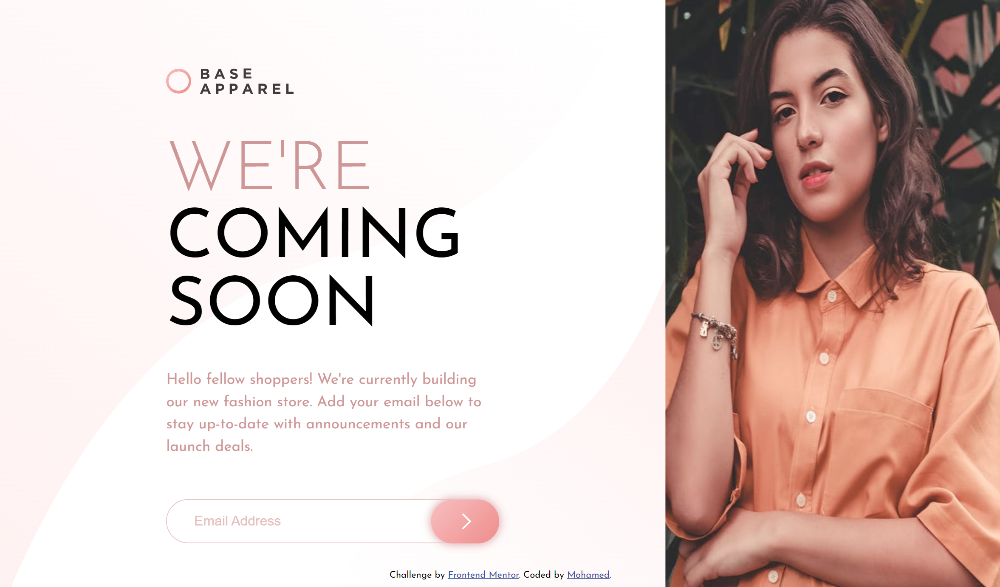
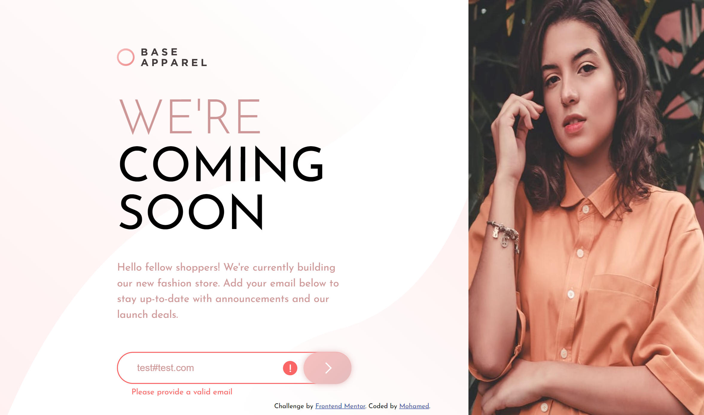
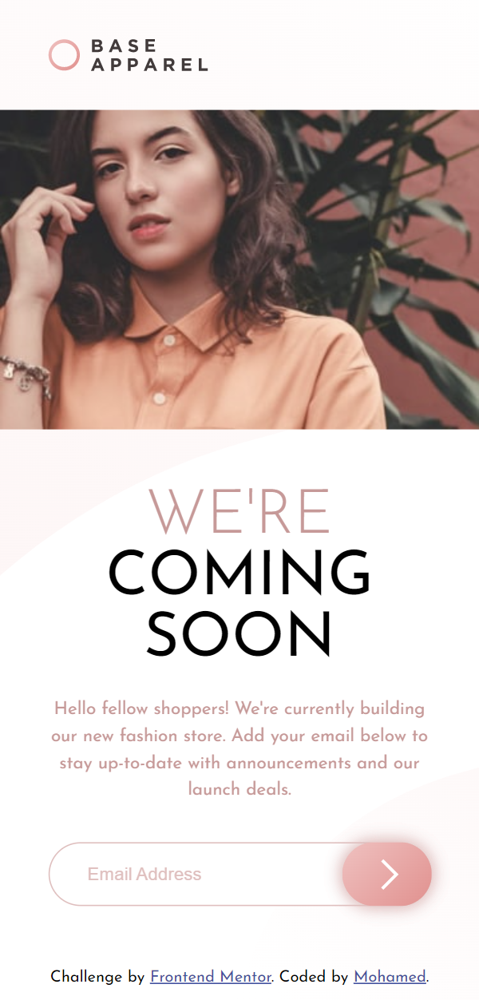

# Frontend Mentor - Base Apparel coming soon page solution

This is a solution to the [Base Apparel coming soon page challenge on Frontend Mentor](https://www.frontendmentor.io/challenges/base-apparel-coming-soon-page-5d46b47f8db8a7063f9331a0).

## Table of contents

- [Overview](#overview)
  - [The challenge](#the-challenge)
  - [Screenshot](#screenshot)
  - [Links](#links)
- [My process](#my-process)
  - [Built with](#built-with)
- [Author](#author)

## Overview

### The challenge

Users should be able to:

- View the optimal layout for the site depending on their device's screen size
- See hover states for all interactive elements on the page
- Receive an error message when the `form` is submitted if:
  - The `input` field is empty
  - The email address is not formatted correctly

### Screenshot

### Links

- Solution URL: [Watch solution](https://your-solution-url.com)
- Live Site URL: [Watch Live](https://m-base-apperal-page.netlify.app/)

## My process

### Built with

- Semantic HTML5 markup
- CSS custom properties
- Flexbox
- CSS Grid
- Mobile-first workflow
- Vanilla JavaScript

### Useful resources

- [email validate regex](https://stackoverflow.com/questions/46155/how-can-i-validate-an-email-address-in-javascript) - This pattern helped me with making the regex of the email validation so easily. I really liked this pattern and will use it going forward.

## Author

- Website - [Mohamed](https://mohamed-dev.netlify.app)
- Frontend Mentor - [@midoashraf010](https://www.frontendmentor.io/profile/midoashraf010)
